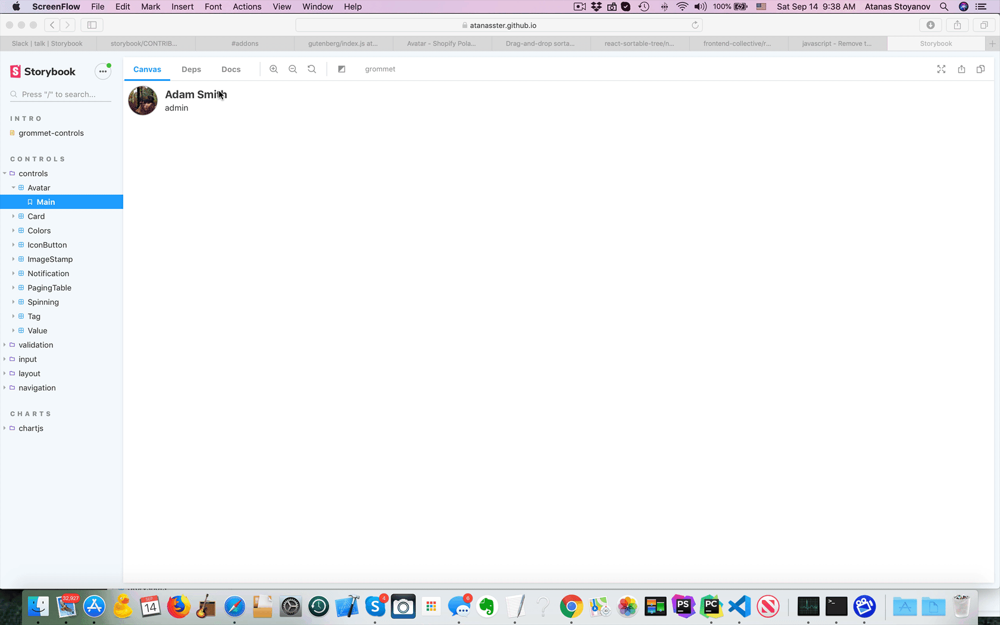

# storybook-dep-webpack-plugin

A webpack plugin to collect dependencies data. 
Works in conjunction with [storybook-addon-deps](https://github.com/atanasster/storybook-addon-deps/)



## Live demo
[grommet-controls](https://atanasster.github.io/grommet-controls/?path=/deps/controls-controls-avatar--main)


## Installation
```sh
npm i -D storybook-dep-webpack-plugin
```

## Usage

in your storybook `webpack.config.js` file add the plugin:

```js
const DependenciesPlugin = require('storybook-dep-webpack-plugin');
...
  config.plugins.push(new DependenciesPlugin({
    options
  }));
```


## Options
**filter** - a RegExp or function to select the stories
example: 
```
  config.plugins.push(new DependenciesPlugin({
    filter: (resource) => {
      return /\.(stories|story)\.[tj]sx?$/.test(resource) && resource.indexOf("Avatar") > -1;
    }
  }));
```

**exclude** - a RegExp for the modules to exclude
example: 
```
  config.plugins.push(new DependenciesPlugin({
    filter: /^@storybook|@babel/,
  }));
```

**maxLevels** - How many levels deep to follow the dependencies
example: 
```
  config.plugins.push(new DependenciesPlugin({
    maxLevels: 10,
  }));
```

**pickProperties** - An array of the props to pick from the module webpack data
example: 
```
  config.plugins.push(new DependenciesPlugin({
    pickProperties: ['id', 'name', 'request'],
  }));
```

**pickModuleProperties** - An array of the props to pick from the module.module webpack data
example: 
```
  config.plugins.push(new DependenciesPlugin({
    pickModuleProperties: [],
  }));
```

## Install and configure `storybook-addon-deps`
[storybook-dep-webpack-plugin](https://github.com/atanasster/storybook-addon-deps/blob/master/README.md)

